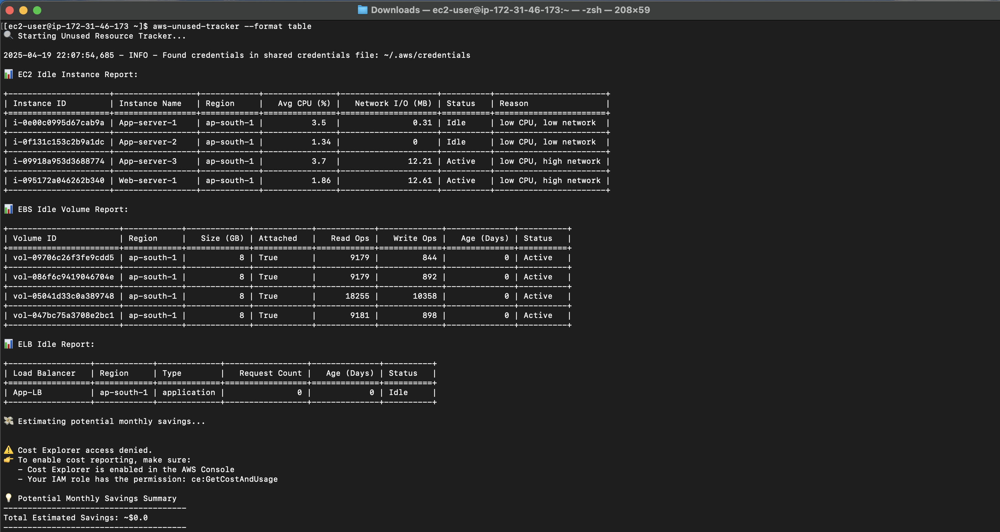

## ✅ `README.md`


[](LICENSE)
[](https://www.python.org/downloads/)
[](https://github.com/Chirag0401/aws-unused-tracker)


# 🧹 AWS Unused Resource Tracker

A CLI tool to **track and report unused AWS resources** across EC2 instances, EBS volumes, and ELBs — helping you identify cloud waste and **optimize AWS costs** 💸.

---

## 📸 Output Preview



---

## 🚀 Features

- 🔍 Scan **EC2, EBS, and ELB** resources for underutilization
- 📊 Analyze usage with CloudWatch metrics (CPU, network, IOPS)
- 🧮 Estimate monthly **cost savings** via AWS Cost Explorer
- 📁 Export results to **CSV / JSON**
- ✅ Use `--dry-run` to preview without exporting or costing
- 🌍 Multi-region support

---

## 📦 Installation

### 1. Clone the repository:

```bash
git clone https://github.com/your-username/aws-unused-tracker.git
cd aws-unused-tracker
```


### 2. Install as a CLI tool:

```bash
pip install .
```

### ✅ Usage

```bash
aws-unused-tracker [OPTIONS]
```

---

## ⚙️ CLI Options

| Option              | Description                                  |
|---------------------|----------------------------------------------|
| `--region`          | Specify one or more AWS regions              |
| `--idle-only`       | Show only idle resources                     |
| `--format`          | Output format: `table`, `json`, `csv`, `all`|
| `--dry-run`         | Preview only, no export or cost estimation  |

---

## 💡 Examples

```bash
# Scan all regions, output to terminal
aws-unused-tracker --format table

# Scan ap-south-1, only show idle
aws-unused-tracker --region ap-south-1 --idle-only

# Dry-run mode (no files or billing data)
aws-unused-tracker --dry-run
```

---

## 🔐 Required IAM Permissions

Minimum read-only permissions:

```json
{
  "Effect": "Allow",
  "Action": [
    "ec2:DescribeInstances",
    "ec2:DescribeVolumes",
    "elasticloadbalancing:DescribeLoadBalancers",
    "cloudwatch:GetMetricStatistics"
  ],
  "Resource": "*"
}
```

**Optional for cost savings estimate:**

```json
{
  "Effect": "Allow",
  "Action": "ce:GetCostAndUsage",
  "Resource": "*"
}
```

👉 Also ensure **Cost Explorer is enabled** in your AWS Billing settings.

---

## 📁 Output Files

By default, output is saved to the `/output` directory:

- `ec2_idle_report.json` / `.csv`
- `ebs_idle_report.json` / `.csv`
- `elb_idle_report.json` / `.csv`

---

## 🛣 Roadmap

- [ ] Slack/email notifications for idle resources
- [ ] Resource tag compliance check
- [ ] Multi-account org-wide support

---

## 👨‍💻 Author

**Chirag Sharma**  
GitHub: [@Chirag0401](https://github.com/Chirag0401)

> Feel free to star ⭐ the repo, submit issues, or contribute!

---

## 📄 License

Licensed under the [MIT License](LICENSE).  
Use it freely, improve it proudly, contribute generously 🙌
```
MIT License

Copyright (c) 2025 Chirag Sharma

Permission is hereby granted, free of charge, to any person obtaining a copy
of this software and associated documentation files (the “Software”), to deal
in the Software without restriction, including without limitation the rights  
to use, copy, modify, merge, publish, distribute, sublicense, and/or sell     
copies of the Software, and to permit persons to whom the Software is         
furnished to do so, subject to the following conditions:                      

The above copyright notice and this permission notice shall be included in    
all copies or substantial portions of the Software.                           

THE SOFTWARE IS PROVIDED “AS IS”, WITHOUT WARRANTY OF ANY KIND, EXPRESS OR    
IMPLIED, INCLUDING BUT NOT LIMITED TO THE WARRANTIES OF MERCHANTABILITY,      
FITNESS FOR A PARTICULAR PURPOSE AND NONINFRINGEMENT. IN NO EVENT SHALL THE   
AUTHORS OR COPYRIGHT HOLDERS BE LIABLE FOR ANY CLAIM, DAMAGES OR OTHER       
LIABILITY, WHETHER IN AN ACTION OF CONTRACT, TORT OR OTHERWISE, ARISING FROM,
OUT OF OR IN CONNECTION WITH THE SOFTWARE OR THE USE OR OTHER DEALINGS IN    
THE SOFTWARE.

```
